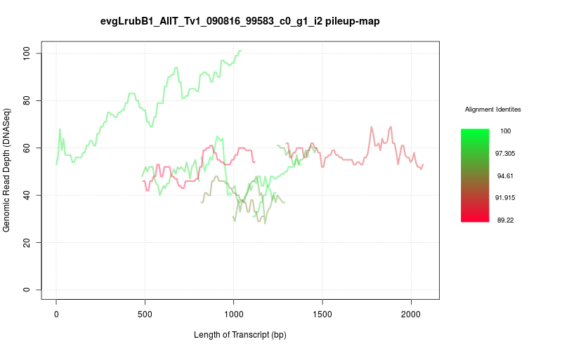

# RNAseq Transcript -> Genome Assembly Pileup Context Graphs

A system to inform the analysis of stand-alone transcriptomes via a respective difficult-to-assemble genome.

When working with organisms with highly allelically divergent genomes (>5% absolute), it can be difficult to distinguish isoforms from paralogs from alleles in the transcriptome assembly. It is also typically the case that the assembled verison of that organism's genome will be a mish-mash of collapsed and uncollapsed alleles, and in the case of assemblies that collapse aggressively, it may also have substantial paralog collapse mis-assemblies as a trade-off.

This short pipeline allows the user to assess the genome assembly circumstance behand the transcript(s) they are interested in.

## Prerequisites 

#### Software

1. [BLAST+](https://blast.ncbi.nlm.nih.gov/Blast.cgi?CMD=Web&PAGE_TYPE=BlastDocs&DOC_TYPE=Download)
2. [Samtools/1.5 or later](http://www.htslib.org/download/)
3. [R 3.x+](https://www.r-project.org/)
4. A short read aligner

#### Data

1. A fasta file containing 'transcripts of interest'
2. A fasta file containing a genome assembly (of dubious quality most likely)
3. The short-read library used to assemble the genome

## Running the data preparation steps

### 1. Align the short-read library to the genome

This can be done with your chosen aligner but highly sensitive presets are recommended

For example with [bbmap](https://github.com/BioInfoTools/BBMap):

```bbmap.sh in1=<reads1.fq> in2=<reads2.fq> out=<mapped_reads.sam> ref=<my_genome.fasta>```

### 2. Sort, Index & Convert bam to custom Wig file

Convert to bam:

```samtools view -bS <mapped_reads.sam> > mapped_reads.bam```

Sort:

```samtools sort -o <sorted.bam> <mapped_reads.bam>```

Index:

```samtools index msort.bam```

## Running the Pipeline

Retrieve this scripts from git

```git clone https://github.com/OliverCardiff/RNA_assembly_context_graphs.git```

Copy/move the genome, bam file, and transcripts to the RNA_assembly_context_graphs folder created by the above command.

Then enter that folder and do the following:

### 0. Run the shell script, or manually complete stages (1-3)

This will run the subsequent commands in order:

```./run_all.sh <sorted.bam> <my_genome.fasta> <transcripts.fasta> <output_directory>```

Or, if the above script has been run before, to save a lot of processing time:

```./run_again.sh <customwig.mat> <my_genome.fasta> <transcripts.fasta> <output_directory>```

### 1. Create Custom Wig file

Run the included script [mpileuptowig.pl](mpileuptowig.pl):

```samtools mpileup <sorted.bam> | perl mpileuptowig.pl > customwig.mat```

### 2. BLAST the transcripts against the genome

Build a local database:

```makeblastdb -in <my_genome.fasta> -dbtype nucl -parse_seqids```

Run 'blastn' sequence search with 'output format 6':

```blastn -query <transcripts.fasta> -db <my_genome.fasta> -evalue 5e-05 -outfmt 6 > blast.outfmt6 ```

### 3. Run the integration and visualisation script

```perl RNA_pileup_insight.pl <blast.outfmt6> <customwig.mat> <outputfile>```

This will produce one PNG, and one PDF image per unique transcript in the blast output file. A kernal read depth density image will also be produced, as an interpretive reference: 'density_reference.png/pdf'

## Interpreting the Output

Each image produced will look something like this one:



Each separate line drawn described a different blast hit found in the genome. The colour of the lines shows the alignment identity. The Y values of the lines show the genomic DNA read pileup at the matched location. X values of the lines show the position along the length of the original transcript which was aligned. Many different high identity/similar read-depth lines on top of each-other indicate that either the genome is over inflated, or the transcript assembly is over-collapsed. 


Comparing the read depths in the graphs to the density peaks in the density reference will inform whether the assembly is matching uncollapsed sequence, a well assembled haplome, or over-collapsed repetitive sequence, based on whether the depths are at 1/2 the highest reference density peak, near the highest peak, or substantially higher than it, respectively.
